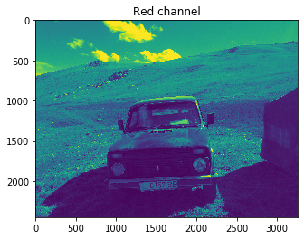

***


                                            “A picture is worth a thousand words”
                             


***                             

Machine Learning is a big field to be in. Sometimes you might get lost in it which happened to me. I wanted to do everything. I did several projects, and finally I found a joy working with images, so I decided to specialize in application of deep learning in ***Computer Vision***.

There are multiples of image processing libraries such as **OpenCV, PILLOW, scikit-image, SciPy-Ndimage** etc. But I am not goin to use those here, instead I will try out simple techniques with Numpy.

There are many great resources to learn Computer Vision. Currently, I am reading **"Deep Learning for Computer Vision"** by Adrian Rosebrock.

Link to his page: https://www.pyimagesearch.com/

Let's load **numpy** and **matplotlib** packages.


```python
import numpy as np
import matplotlib.pylab as plt
```

***
Let's upload the picture. The astype('float32') converts the image to float, and dividing it to 255 makes sure that the pixel value range will be in [0, 1] range rather than [0, 255] range.


```python
img = plt.imread('jailoo.jpeg').astype('float32')/ 255 # uploading an image
print(img.shape)
```

    (2448, 3264, 3)


```python
plt.imshow(img)
plt.show()
```


***I took this picutre in 2015, in Naryn, Kyrgyzstan.*** 

### Now, let's look at the basic properties of the image.


```python
print('Type of the image : ' , type(img))
print()
print('Shape of the image : {}'.format(img.shape))
print('Image Hight {}'.format(img.shape[0]))
print('Image Width {}'.format(img.shape[1]))
print('Dimension of Image {}'.format(img.ndim))
```

    Type of the image :  <class 'numpy.ndarray'>
    
    Shape of the image : (2448, 3264, 3)
    Image Hight 2448
    Image Width 3264
    Dimension of Image 3


The picture is **2448 x 3264 x 3** dimensional array. First two numbers are {**Y** for **height** and **X** for **width**}, the last value is **RGB** value of the pciture. Basically we have 3 layered matrix that contains each RBG value for every single pixel of the picture.

We can get the total number of pixels, maximum and minimum of RGB values in the picture.

Total pixels = **X** x **Y** x **3**


```python
print('Total number of pixels {}'.format(img.size))
print('Max value of RGB {}'.format(img.max()))
print('Min value of RGB {}'.format(img.min()))
```

    Total number of pixels 23970816
    Max value of RGB 1.0
    Min value of RGB 0.0


## **Cropping**

We can easily cut out a piece of the picture just by slicing the arrays. For instance, I need only the car in the picture. 


```python
plt.imshow(img[900:,750:2300,:])
plt.show()
```


***RGB*** stands for **Red, Blue and Green**. Combination of these colors make up the entire spectre of colors. Each color (red, blue, green) takes values from ***0 to 255***. If the value is **0** then it is **black**, if it is **255** then the color is **white**. 

***In this case, pixel values are in [0,1] range since we standardized it by dividing it to 255.***

We can pick specific pixel in the picture and see its RGB value. Let's do that!


```python
# little function to get pixel values

def show_rgb(image,y,x):
    """
    y - height
    x - width
    """
    return image[y,x]

# let's see what are the RGB values of the pixel at 1500th row, 1500th column
show_rgb(img,1500,1500)
```


    array([0.1882353 , 0.39215687, 0.54509807], dtype=float32)


Each index value corresponds to RGB value of a pixel:

* <font color='red'> **Index 0 - Red = 0.1882353** </font>
* <font color='green'> **Index 1 - Green = 0.39215687** </font>
* <font color='blue'> **Index 2 - Blue = 0.54509807** </font>

## **Splitting Into Channels**

### We can see the picture from each color channel:


```python
plt.title('Red channel')
plt.imshow(img[:, : , 0])
plt.show()
```





```python
plt.title('Green channel')
plt.imshow(img[:, : , 1])
plt.show()
```


```python
plt.title('Blue channel')
plt.imshow(img[:, : , 2])
plt.show()
```


**Splitting the picture by channels:**


```python
image = plt.imread('jailoo.jpeg')

fig, axs = plt.subplots(nrows=1, ncols=3, figsize=(15,5))

for c, ax in zip(range(3), axs):
    img_ = np.zeros(image.shape, dtype="uint8")
    img_[:,:,c] = image[:,:,c]
    ax.imshow(img_)
    ax.set_axis_off()
```


That's it for now. There are many complex and very interesting image processin techniques you can apply using powerful image processing libraries. For example, you can explore ***matplotlib***.

Convert RGB to HSV color-space.


```python
from matplotlib.colors import rgb_to_hsv
hsv_image = rgb_to_hsv(img)
plt.imshow(hsv_image)
plt.show()
```


```python

```
